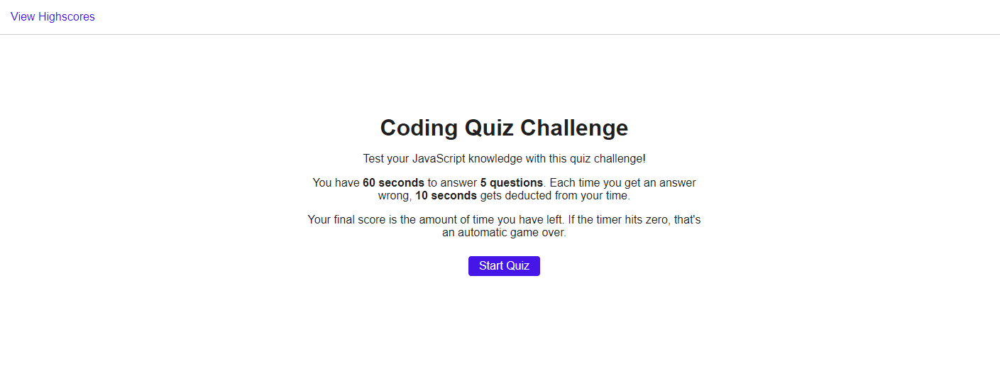

# Code Quiz

This website is a timed quiz on JavaScript.

Like other bootcamp assignments, a user story and acceptance criteria were provided; however, no starter code was provided.

:link: [JavaScript Code Quiz Website](https://angelicamapeso.github.io/bootcamp-code-quiz/)

## The Rules

- The quiz is made up of 5 questions presented one at a time
- The user has 60 seconds to complete the quiz
- Everytime the user selects an answer:
  - A message tells them if the answer was correct/incorrect
  - If the answer was incorrect, 10 seconds is deducted from the timer
- The game ends once the timer hits 0 or the user answers all the questions

### Scoring

- The user's remaining time is their final score
- The user may save their score to their local storage by entering their initials
- All the saved scores can be viewed on the highscores page

## Purpose

Based on the given user story, this quiz is for students learning JavaScript who want to see how their knowledge compares to their peers.

## Concepts Used

### CSS

- CSS Transitions
- Breakpoints

### Javascript

- Classes
- Event Listeners
- `setTimeout`/`setInterval`
- Using Local Storage

### Additional Resources

- [Font Awesome 5.14](https://fontawesome.com/)
